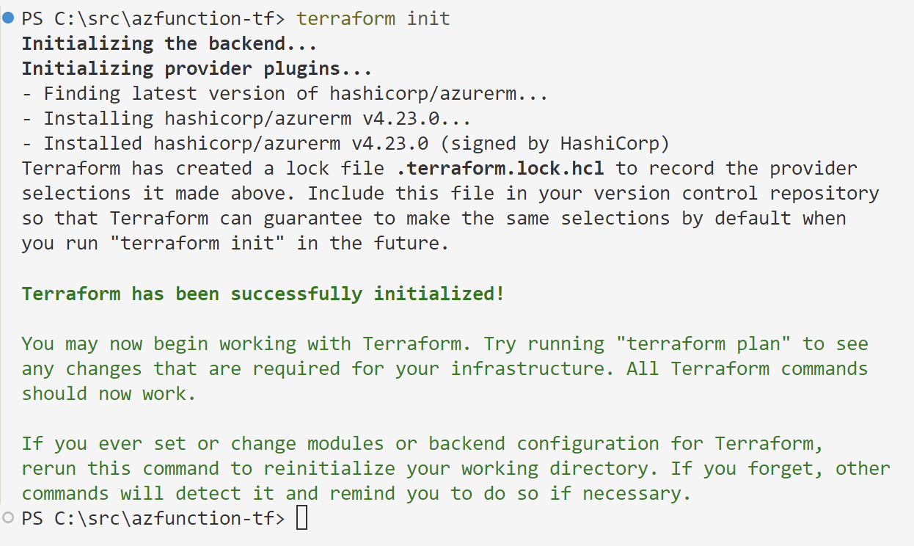
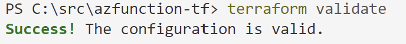
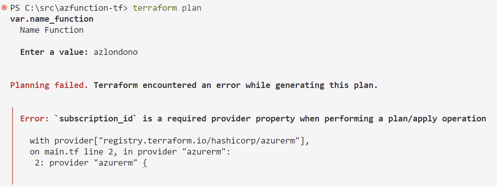
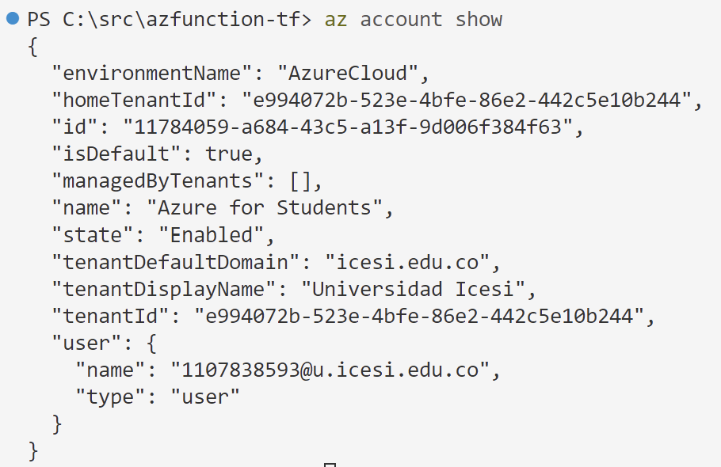
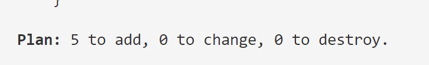
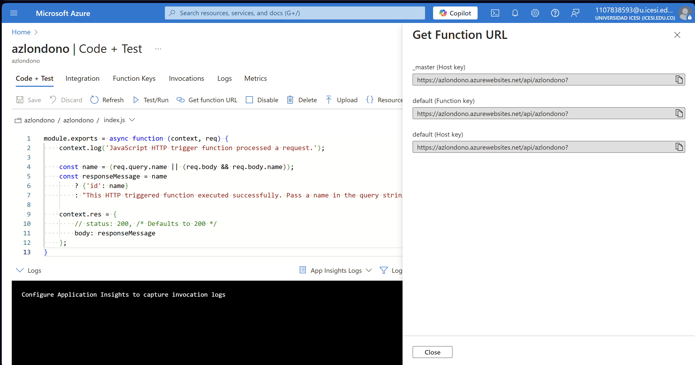
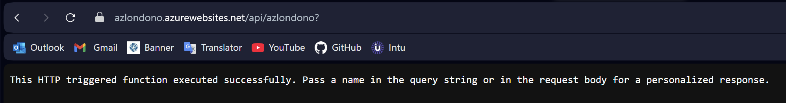

### Deploy An Azure Function with Terraform Guide
### Alejandro Londoño Bermúdez
### Software Engineering V

#### Step by step of this guide.

1) Understand the structure of the services to build an azure function.

2) Define services in their first version (without variables).

  Created Resources:

  * Resource Group: Organizes and manages Azure resources.

  * Storage Account: Stores data like blobs, files, and queues, in this case, the windows function app.

  * Service Plan: Defines resource limits and pricing for services.

  * Windows Function App: Runs serverless functions on Windows.

  * Function App Function: Executes code in response to events.


3) Define variables.tf to abstract name references.

4) Define output.tf to capture attributes and values of deployed services.

5) Rebuild services with references of the defined variables.

6) Write terraform.tfvars to initialize non-default variables.

7) Execute terraform commands to deploy in the cloud :)

    **terraform fmt** to format .tf files

    **terraform init** to initialize a Terraform working directory. It installs the necessary provider plugins and sets up the environment to interact with cloud services.

    

    **terraform validate** to validate the configuration files to check for syntax errors or issues in the code before you plan or apply changes.

    

    **terraform plan** to create an execution plan, showing what actions Terraform will take to reach the desired state. It allows you to review potential changes and errors before applying them.

    

    Correct subscription_id

    

    
    
    **terraform apply** to apply the changes outlined in the execution plan.

    **Evidence of the result:**

    

    


8) **terraform destroy** If you terminate the guide and you want to prevent extra costs, remember destroy the services!


## Pre-Guide

### **Infraestructura como código**

- **Utilizar archivos de definición**: Todas las herramientas de infraestructura como código tienen un formato propio para definir la infraestructura.
- **Autodocumentación de procesos y sistemas**: Al utilizar el enfoque de infraestructura como código, podemos reutilizar el código. Es importante que este esté documentado adecuadamente para que otros usuarios comprendan el propósito y funcionamiento del módulo.
- **Versionar todo**: Esto nos permite rastrear los cambios realizados. Si se comete un error, podemos retroceder a una versión estable.
- **Preferir cambios pequeños**: Realizar cambios pequeños para evitar grandes impactos.
- **Mantener los servicios continuamente disponibles**: Garantizar la disponibilidad continua es clave en la infraestructura.

### **Beneficios de la infraestructura como código**

- **Creación rápida y bajo demanda**: Con un único archivo de definición de infraestructura que almacena todas nuestras configuraciones, podemos crear múltiples veces la infraestructura sin necesidad de rehacer todo desde el principio.
- **Automatización**: Una vez creado el archivo de definición, podemos usar herramientas de **continuous integration** para automatizar la infraestructura.
- **Visibilidad y trazabilidad**: El versionamiento de la infraestructura como código permite una mayor visibilidad y trazabilidad, ya que todos los cambios quedan registrados.
- **Ambientes homogéneos**: Podemos crear varios ambientes a partir del mismo archivo de definición, cambiando únicamente algunos parámetros.

---

### **Mejores prácticas**

- **Modularidad**: Es recomendable dividir la infraestructura en módulos reutilizables para facilitar su mantenimiento y escalabilidad.
- **Mantener las configuraciones centralizadas**: Utilizar variables y archivos de configuración para gestionar parámetros y evitar valores "hardcoded".
- **Manejo seguro del estado**: Almacenar el archivo `terraform.tfstate` de manera remota (por ejemplo, en un bucket S3 con bloqueo de versión) para evitar problemas en equipos distribuidos.
- **Revisiones de código y pull requests**: Antes de aplicar cambios importantes en la infraestructura, hacer revisiones mediante pull requests para asegurar que los cambios han sido revisados por otros.

### **Ambientes**

Terraform permite la creación de múltiples ambientes (dev, stage, prod) con diferentes configuraciones. Puedes gestionar estos ambientes utilizando archivos `.tfvars` específicos para cada entorno.

- **Ambiente de desarrollo (dev)**: Se recomienda utilizar recursos más pequeños y económicos en este ambiente para reducir costos.
- **Ambiente de producción (prod)**: Aquí es importante configurar instancias y recursos con redundancia y alta disponibilidad.
  
Ejemplo de estructura para gestionar ambientes:

```bash
├── main.tf
├── variables.tf
├── dev.tfvars
├── prod.tfvars
```

Al aplicar los cambios para un ambiente en específico, puedes ejecutar:

```bash
terraform apply --var-file="dev.tfvars"
```

### **Automatización con CI/CD**

Integrar Terraform en un flujo de CI/CD es una excelente práctica para automatizar la gestión de la infraestructura. Puedes utilizar herramientas como Jenkins, GitLab CI, o GitHub Actions para automatizar el proceso de despliegue y validación.

Ejemplo de un pipeline básico en GitLab CI:

```yaml
stages:
  - validate
  - plan
  - apply

validate:
  script:
    - terraform init
    - terraform validate

plan:
  script:
    - terraform plan

apply:
  script:
    - terraform apply --auto-approve
```

Este pipeline primero inicializa el entorno, luego valida la configuración, y finalmente aplica los cambios automáticamente.

### **Seguridad**

- **Manejo seguro de credenciales**: Nunca almacenar credenciales en el código fuente. Utilizar herramientas como **AWS Secrets Manager** o **HashiCorp Vault** para gestionar los secretos de manera segura.
- **Control de acceso basado en roles (IAM)**: Asignar roles y permisos específicos a los recursos de Terraform mediante políticas de IAM para restringir el acceso según sea necesario.
- **Cifrado de datos**: Utilizar cifrado en reposo y en tránsito para proteger los datos sensibles, como el uso de **KMS (Key Management Service)** de AWS.
- **Seguridad en el estado**: Si almacenas el archivo `terraform.tfstate` en un bucket S3, asegúrate de habilitar el cifrado y el control de versiones para evitar modificaciones no autorizadas.

---

### **Manejo de variables en Terraform**

Para hacer escalable y reutilizable el archivo de definición de infraestructura, se recomienda no usar valores "hardcoded". Terraform permite crear variables de los siguientes tipos:

- **string**
- **number**
- **boolean**
- **map**
- **list**

Si no se declara un tipo, el valor por defecto será `string`. Sin embargo, es una buena práctica especificar el tipo de la variable.

Ejemplo de definición de variables:

```terraform
variable "ami_id" {
  type        = string
  description = "ID de la AMI"
}

variable "instance_type" {
  type        = string
  description = "Tipo de instancia"
}

variable "tags" {
  type        = map
  description = "Etiquetas para la instancia"
}
```

### **Asignar valores a las variables**

Los valores de las variables se pueden asignar de tres maneras:

1. Utilizando variables de entorno.
2. Pasándolos como argumentos en la línea de comandos.
3. Mediante un archivo `.tfvars` con formato `key = value`.

Ejemplo de archivo `.tfvars`:

```terraform
ami_id        = "ami-0ca0c67309196175e"
instance_type = "t2.micro"
tags = {
  Name       = "devops-tf"
  Environment = "Dev"
}
```

Para usar este archivo con variables:

```bash
terraform apply --var-file="dev.tfvars"
```

### **Destruir la infraestructura**

Para eliminar la infraestructura creada, se puede utilizar:

```bash
terraform destroy --var-file="dev.tfvars" -auto-approve
```


